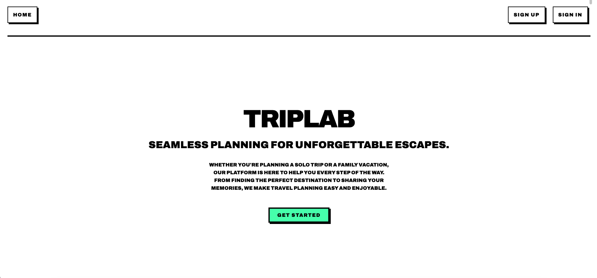

# TripLab

#### Seamless planning for unforgettable escapes.

## Description
TripLab is a collaborative travel planning platform designed to make organizing your next adventure simple and seamless. Whether you're mapping out a weekend getaway or a bucket-list journey with friends, TripLab brings your plans together in one easy-to-use space.

## Quick Links
* **Project planning** can be found [here](https://trello.com/b/epUCcSl0/travel-app).
* **Wireframe** can be found [here](https://lucid.app/lucidchart/bcf47620-83d2-4df6-97f1-8463e40dfd30/edit?invitationId=inv_9ebe864a-4e20-4917-ae79-88fcaa82c609&page=0_0#).
* **GitHub repo: Front-end** can be found [here](https://github.com/JadAoun1/travel-companion-frontend).
* **GitHub repo: Back-end** can be found [here](https://github.com/JadAoun1/travel-companion-backend).
* **Deployed project** link can be found [here](https://triplabapp.netlify.app/).

## Table of Contents
* [Technologies Used](#technologiesused)
* [Attributions](#attributions)
* [Features](#features)
* [Design](#design)
* [Project Next Steps](#nextsteps)
* [Team](#team)
* [Works Cited](#workscited)

## Technologies Used
* MongoDB + Mongoose
* Express
* React
* Node
* Javascript
* Google Maps API
* CSS
* bcrypt
* dotenv

## Attributions
* [Google Maps Geocoding API](https://developers.google.com/maps/documentation/geocoding): used to convert addresses or Place IDs to latitude/longitude coordinates
* [Google Maps Places (New) API](https://developers.google.com/maps/documentation/places/web-service/op-overview): used to convert geocoding data to place details, including location name ('displayName').
* [Google Maps JavaScript API](https://developers.google.com/maps/documentation/javascript/overview): client-side web API used alongside [react-google-maps](https://visgl.github.io/react-google-maps/) to integrate Google Maps into a React application

## Design
* For the website's design, we looked at several different themes. We agreed that we liked the Brutalist/Neo-Brutalist style the best, so we chose that. After deciding on the style, we found resources and examples of it to use as inspiration.

## Project Next Steps
* Replace current dropdown for adding users to a trip with a searchable input field allowing users to search by usernames to easily add others to their trips. 
* Refactor MapView.jsx to lift state so that Google Maps Places (New) API data can be rendered elsewhere.
* Build out models to incorporate more data within the UI (including, but not limited to user profiles, and destination/attraction details)
* Incorporate in-app messaging system so users assigned to the same trip can communicate. 
* Show multiple markers on trip and destination show page maps. 
* Utilize more capababilities of the Google Maps Places (New) API to allow users to find additional nearby attractions.

## Team
* Scrummaster: Jad Aaoun
* Backend Lead: Anna Steckel
* Frontend Lead: Amen Ali

## Works Cited:
* **[General Assembly Hoot Front-End](https://pages.git.generalassemb.ly/modular-curriculum-all-courses/react-hoot-front-end/setup/)**: Helped with initial front end set-up. 
* **[General Assembly Hoot Back-End](https://pages.git.generalassemb.ly/modular-curriculum-all-courses/express-api-hoot-back-end/create-hoot/)**: Helped with initial back-end set up for routes 
* **[General Assembly JWT-Auth in React](https://pages.git.generalassemb.ly/modular-curriculum-all-courses/jwt-authentication-in-react/setup/)**: This lecture helped setup user authorization and JWT token based authentication to signup, signin, and signout.
* **[JWT Authentication in Express APIs](https://pages.git.generalassemb.ly/modular-curriculum-all-courses/jwt-authentication-in-express-apis/canvas-landing-pages/seb.html)**: Used for initial backend setup for JWT token-based authentication.
* **[git revert vs reset](https://medium.com/@halilatilla/git-revert-and-reset-understanding-their-purpose-and-differences-d11a913e288)**: This project was a crash course in github collaboration so we utilized git reset on multiple occasions to get to our last working version.
* **[Google API docs](https://developers.google.com/maps)**: Anna learned firsthand just how hard these docs are to navigate (pun intended).
* **[How to Implement Google Places API in Your Application (JS, Express, Node.js)](https://medium.com/swlh/how-to-implement-google-places-api-in-your-application-js-express-node-js-97b16da24835)**: This was a super brief overview of how to implement Google Places API. The research that followed reading this article included a deep rabbit hole of guides that required Typescript translation into Javascript, lots of chatGPT prompts like, "Can you explain _____ concept when implementing Google Maps API?", and many YouTube tutorials. 
* **[SyntaxError: Unexpected token '<', "<!DOCTYPE "... is not valid JSON](https://stackoverflow.com/questions/73359274/syntaxerror-unexpected-token-doctype-is-not-valid-json)**: This was just one of many resources we used when getting this error message (which happened far more than we would have liked).
* **[Optional chaining](https://developer.mozilla.org/en-US/docs/Web/JavaScript/Reference/Operators/Optional_chaining)**: Used to determine if an object or function accessed is undefined or null.  
* **[Full React Tutorial by Net Ninja](https://www.youtube.com/watch?v=PHaECbrKgs0)**: And other YouTube tutorials refreshing our understanding of React.
* **[React DOM Components](https://react.dev/reference/react-dom/components)**: This resource was used to understand form components and how to use select in different ways.  
* **[StackOverflow: Generate options by mapping over array of objects with react-select ](https://stackoverflow.com/questions/55173409/generate-options-by-mapping-over-array-of-objects-with-react-select/55173797#55173797)**: This helped understand how to generate select options by mapping over an array so users can be seen in a dropdown.  
* **[GeeksforGeeks: Mongoose Populate Method](https://www.geeksforgeeks.org/mongoose-populate-method/)**: This helped give a better understanding on the .populate() method and how to use it to retrieve data in queries. 
* **[MDN: .toString() Method](https://developer.mozilla.org/en-US/docs/Web/JavaScript/Reference/Global_Objects/Object/toString)**: This filled learning gaps and helped in understanding how the toString() method works, and how it can be used in different parts of the code to convert values to strings.
* **[How To Manage User Roles In Node.js – Web Dev Simplified:](https://www.youtube.com/watch?v=jI4K7L-LI58&ab_channel=WebDevSimplified)**: This video helped to understand how to add roles to different users and control what they have access to.
* **[Trend Deep Dive: Neo-brutalism - Envato Author](https://author.envato.com/hub/trend-deep-dive-neo-brutalism/)**: Provided an overview of Neo-Brutalism (Neubrutalism), linking it to Brutalist architecture and outlining key characteristics like bold typography, vibrant colors, hard shadows, and asymmetry. Useful for understanding the core aesthetic principles that influenced our design choices.
* **[Neo-brutalism: Raw Aesthetics in Web Design - 618Media](https://618media.com/en/blog/neo-brutalism-raw-aesthetics-in-web-design/)**: Helped understand the philosophy behind Neo-Brutalism, focusing on raw aesthetics, honesty in design, intentional roughness, and prioritizing function, informing the overall look and feel.
* **[NeoBrutalismCSS - Minimalist CSS Library (GitHub)](https://github.com/matifandy8/NeoBrutalismCSS)**: Explored this lightweight CSS library inspired by neo-brutalist principles as a reference for implementing the style using simple, modular classes based on HTML semantics.
* **[Neobrutalism components (neobrutalism.dev)](https://www.neobrutalism.dev/)**: Referenced for pre-built components and practical coding implementation details related to Neo-Brutalism, especially regarding CSS Variables vs. utility classes and potential framework configurations.
* **[`cors` npm package documentation](https://www.npmjs.com/package/cors#configuration-options)**: Referenced for configuring the CORS middleware options, including setting specific allowed `origin`s, `methods`, `allowedHeaders`, `credentials`, and handling preflight requests (`optionsSuccessStatus`) to enable secure communication between the frontend and the backend API.
* **[MDN Web Docs: Cross-Origin Resource Sharing (CORS)](https://developer.mozilla.org/en-US/docs/Web/HTTP/CORS)**: Provided fundamental understanding of the CORS mechanism, preflight requests (OPTIONS method), and the HTTP headers (`Access-Control-Allow-Origin`, etc.) that the `cors` middleware manages.
* **Google Gemini**: Assisted in sample implementation of CORS backend in server.js.
